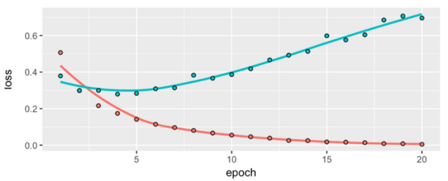
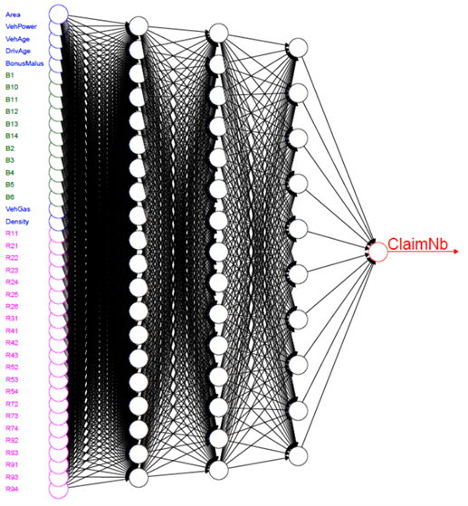

```{r setup, include=FALSE}
knitr::opts_chunk$set(
  echo = TRUE, 
  warning = FALSE,
  message = FALSE, 
  fig.height = 10,
  fig.width = 12
)
#| include: false

# 设置随机种子
myseed = 1234
# rerun the code to build all models if update_code = 1
# load the model from local if update_code = 0
update_code = 0
# create a folder to restore Rdata files.
folder_name = 'Rdata'
if (!file.exists(folder_name)) {
  # If not, create the folder
  dir.create(folder_name)
}

# Define some functions to save and load objects.
file.exists.local <- function(filename,folder = folder_name){
  path <- paste0(folder,"/",filename)
  return(file.exists(path))
}

save.file.local <- function(dat,folder = folder_name){
  # Collect the file name
  filename <- deparse(substitute(dat))
  
  # assign(filename, dat)
  save_path = paste0(folder,"/",filename, '.Rdata')
  save(list = filename, file = save_path)
}

load.file.local <- function(filename,folder = folder_name){
  load_path <- file.path(folder,filename)
  load(load_path,envir = .GlobalEnv)
}
```

## 介绍

在本文档中，我们将探讨使用前馈神经网络（FNN）来分析法国机动车第三者责任索赔。我们将讨论架构选择、缺失值处理以及各种练习，以了解模型的性能和依赖性。

此 notebook 是 SSRN 上的“[来自神经网络内部的见解](https://www.ssrn.com/)”教程的配套教材。

该代码与上面教程中使用的代码相似，并结合了脚本中的原始 R 代码，可在 GitHub 上获得包含更多注解的内容。请参考教程来获取解释。

请注意，结果可能会因 R 和 Python 包版本而异，有关 `sessionInfo()` 的结果和 Python 设置的相应信息，请参见最后一节。


## 数据准备

本教程使用 openML [openML (ID 41214)](https://www.openml.org/d/41214) 上可用的 French MTPL 数据集。

### 加载包和数据

```{r}
library(keras)
library(magrittr)
library(dplyr)
library(tibble)
library(purrr)
library(ggplot2)
library(gridExtra)
library(splitTools)
library(tidyr)
```

```{r}
# plotting parameters in R Markdown notebook
knitr::opts_chunk$set(fig.width = 9, fig.height = 9)
# plotting parameters in Jupyter notebook
library(repr)  # only needed for Jupyter notebook
options(repr.plot.width = 9, repr.plot.height = 9)
```

### 设置全局参数

```{r}
options(encoding = 'UTF-8')
```

```{r}
# set seed to obtain best reproducibility. note that the underlying architecture may affect results nonetheless, so full reproducibility cannot be guaranteed across different platforms.
seed <- 100
Sys.setenv(PYTHONHASHSEED = seed)
set.seed(seed)
reticulate::py_set_seed(seed)
tensorflow::tf$random$set_seed(seed)
```

下面的结果与论文中的结果不完全匹配，因为底层数据集和一些包是不同的。此外，训练和测试数据的划分也不同。但是，总的结论是相同的。

### 辅助函数

随后，为了便于阅读，我们在本节中提供了本教程中使用的所有辅助函数。

```{r}
summarize <- function(...) suppressMessages(dplyr::summarize(...))
```

```{r}
load_data <- function(file) {
  load(file.path("./0_data", file), envir = parent.frame(1))
}
```

```{r}
# Poisson deviance
PoissonDeviance <- function(pred, obs) {
    200 * (sum(pred) - sum(obs) + sum(log((obs/pred)^(obs)))) / length(pred)
}
```

```{r}
plot_freq <- function(test, xvar, title, model, mdlvariant) {
  out <- test %>% group_by(!!sym(xvar)) %>%
            summarize(obs = sum(ClaimNb) / sum(Exposure), pred = sum(!!sym(mdlvariant)) / sum(Exposure))
  
  ggplot(out, aes(x = !!sym(xvar), group = 1)) +
    geom_point(aes(y = pred, colour = model)) +
    geom_point(aes(y = obs, colour = "observed")) + 
    geom_line(aes(y = pred, colour = model), linetype = "dashed") +
    geom_line(aes(y = obs, colour = "observed"), linetype = "dashed") +
    ylim(0, 0.35) + labs(x = xvar, y = "frequency", title = title) +
    theme(legend.position = "bottom")
}
```

```{r}
plot_loss <- function(x) {
  if (length(x) > 1) {
    df_val <- data.frame(epoch = 1:length(x$loss), train_loss = x$loss, val_loss = x$val_loss)
    df_val <- gather(df_val, variable, loss, -epoch)
    p <- ggplot(df_val, aes(x = epoch, y = loss)) + geom_line() +
      facet_wrap(~variable, scales = "free") + geom_smooth()
    suppressMessages(print(p))
  }
}
```

### 加载数据

我们考虑包含在 R 包 CASdatasets 中的数据集 `freMTPL2freq` 用于索赔频率建模。该数据包括法国汽车第三方责任 (MTPL) 保险组合，以及在一个会计年度观察到的相应索赔次数。我们没有纳入索赔规模，这也可以通过 `freMTPL2sev` 获取。

由于当前的包版本提供了一个稍微修改过的数据集，我们使用 openML (ID 41214) 上可用的旧数据集。在我们可以使用这个数据集之前，我们需要做一些数据清理。F. Loser 指出，某些索赔次数似乎不正确。因此，我们使用 *Statistical Foundations of Actuarial Learning and its Applications* 一书中附录 A.1 中描述的数据预处理方法。可以从此处的课程 [GitHub](https://github.com/actuarial-data-science/CourseDeepLearningWithActuarialApplications) 页面下载此预处理数据。


```{r}
load_data("freMTPL2freq.RData")
```

### 数据预处理

先验地，没有足够的关于这些数据的信息来对风险暴露数测量的最佳考虑做出明智的决定，无论是作为特征还是作为偏移量。在下文中，我们始终将风险暴露数视为偏移量。

数据预处理包括几个转换。我们确保 `ClaimNb` 是一个整数，`VehAge`、`DrivAge` 和 `BonusMalus` 分别在 20 岁、90 岁和 150 的水平上设置了上限，以提高可视化效果。`Density` 是对数的，`VehGas` 是一个分类变量。我们放弃了第一个 notebook 中使用的四舍五入，它主要用于更好地可视化数据。

我们正在添加一个 `group_id` 标识可能引用相同保单的行。在数据拆分技术（训练/测试、交叉验证）中考虑 `group_id` 是必不可少的。这与使用了另一种拆分方法的教程不同。因此，本 notebook 中的图形与教程中的图形不匹配，但得出的结论是相同的。

我们决定截断索赔次数和索赔金额以纠正不合理的数据输入并简化建模部分。


```{r}
# Grouping id
distinct <- freMTPL2freq %>% 
  distinct_at(vars(-c(IDpol, Exposure, ClaimNb))) %>% 
  mutate(group_id = row_number())
```

```{r}
dat <- freMTPL2freq %>% 
  left_join(distinct) %>% 
  mutate(ClaimNb = pmin(as.integer(ClaimNb), 4),
         VehAge = pmin(VehAge, 20),
         DrivAge = pmin(DrivAge, 90),
         BonusMalus = pmin(BonusMalus, 150),
         Density = round(log(Density), 2),
         VehGas = factor(VehGas),
         Exposure = pmin(Exposure, 1))
```

```{r}
# Group sizes of suspected clusters
table(table(dat[, "group_id"]))
```

### 关于广义线性模型的特征预处理

如前所述，通常特征$x_i$在用于特定模型之前需要进行预处理。在我们的 Poisson GLM 中，回归函数由连续特征分量中的对数-线性形式建模。在这里做出以下选择：

- **`Area`**：我们为$\{A,\ldots,F\}\mapsto\{1,\ldots,6\}$选择一个连续（对数-线性）特征分量；
- **`VehPower`**：我们选择一个分类特征，其中我们合并大于等于 9 的车辆功率组（总共 6 个类别）；
- **`VehAge`**：我们建立 3 个分类类别$[0,1),[1,10],(10,\infty);\leftrightarrow$；
- **`DrivAge`**：我们构建了 7 个分类类别$[18,21),[21,26),[26,31),[31,41),[41,51),[51,71),[71,\infty);~\leftrightarrow$；
- **`BonusMalus`**：连续对数-线性特征（上限设为 150）；
- **`VehBrand`**：分类特征（共11类）；
- **`VehGas`**：二分类特征；
- **`Density`**：log-density 被选为连续的对数-线性特征组件（请注意，对于小的 log-densities，我们的数值非常小）；
- **`Region`**：分类特征组件（共22类）；

因此，我们考虑 3 个连续特征分量（`Area`、`BonusMalus`、`log-Density`）、1 个二元特征分量（`VehGas`）和 5 个分类特征分量（`VehPower`、`VehAge`、`DrivAge`、`VehBrand`、`Region`）。`VehPower`、`VehAge` 和 `DrivAge` 的这些分类类别仅根据专家意见完成。该专家意见试图在类别标签中找到同质性，并且每个类别标签都应获得足够的（观察）量。


```{r}
dat2 <- dat %>% mutate(
  AreaGLM = as.integer(Area),
  VehPowerGLM = as.factor(pmin(VehPower, 9)),
  VehAgeGLM = cut(VehAge, breaks = c(-Inf, 0, 10, Inf), labels = c("1","2","3")),
  DrivAgeGLM = cut(DrivAge, breaks = c(-Inf, 20, 25, 30, 40, 50, 70, Inf), labels = c("1","2","3","4","5","6","7")),
  BonusMalusGLM = as.integer(pmin(BonusMalus, 150)),
  DensityGLM = as.numeric(Density),
  VehAgeGLM = relevel(VehAgeGLM, ref = "2"),   
  DrivAgeGLM = relevel(DrivAgeGLM, ref = "5"),
  Region = relevel(Region, ref = "R24")
)
```

我们注意到，对于分类变量，我们使用 R 中的数据类型因子。这种数据类型在相应的 R 过程中自动考虑虚拟编码。分类变量被初始化为一个类（参考水平）。我们通常初始化为具有最大容量的类。这种初始化是通过命令 relevel 实现的，见上文。此初始化不会影响拟合均值，但会提供独特的参数化。有关详细信息，请参阅 `?relevel`。

```{r eval=FALSE, include=TRUE}
?relevel
```


### 检查准备好的数据集

```{r}
knitr::kable(head(dat2))
```

```{r}
str(dat2)
```

```{r}
summary(dat2)
```

### 划分训练和测试数据集

首先，我们将数据集拆分为训练和测试。由于保单中潜在的行分组，我们不能只进行随机拆分。为此，我们使用 `splitTools` 包中的函数 `partition(...)`。

```{r}
ind <- partition(dat2[["group_id"]], p = c(train = 0.8, test = 0.2), 
                 seed = seed, type = "grouped")
train <- dat2[ind$train, ]
test <- dat2[ind$test, ]
```

它描述了我们对学习数据集$\mathcal{D}$和测试数据集$\mathcal{T}$的选择，即我们将 80% 的保单随机分配给$\mathcal{D}$,将其余 20% 的保单分配给$\mathcal{T}$。4
通常，90/10 或 80/20用于划分训练和测试数据。这是建模的经验法则和最佳实践。可以在[这里](https://stackoverflow.com/questions/13610074/is-there-a-rule-of-thumb-for-how-to-divide-a-dataset-into-training-and-validatio)找到一个很好的解释，引用如下：“有两个相互竞争的问题：训练数据越少，参数估计的方差越大；测试数据越少，性能统计数据的方差就越大。一般来说，你应该关注划分数据使得两组方差都不会太高，这更多地与每个类别中的实例的绝对数量有关，而不是百分比。”


```{r}
# size of train/test
sprintf("Number of observations (train): %s", nrow(train))
sprintf("Number of observations (test): %s", nrow(test))

# Claims frequency of train/test
sprintf("Empirical frequency (train): %s", round(sum(train$ClaimNb) / sum(train$Exposure), 4))
sprintf("Empirical frequency (test): %s", round(sum(test$ClaimNb) / sum(test$Exposure), 4))
```

## 存储模型结果

当我们要比较各种模型时，我们创建了一个表，其中存储了我们将用于比较和选择最佳模型的指标。

```{r}
# initialize table to store all model results for comparison
df_cmp <- tibble(
 model = character(),
 epochs = numeric(),
 run_time = numeric(),
 parameters = numeric(),
 in_sample_loss = numeric(),
 out_sample_loss = numeric(),
 avg_freq = numeric(),
)
```

在接下来的章节中，我们将为数据拟合各种前馈神经网络。最后，我们将比较几个拟合模型的性能和好坏。我们使用上面定义的指标来比较它们。

###  模型假设

在拟合任何神经网络之前，我们先拟合一个作为基准模型的广义线性模型（GLM）。
在下文中，我们将基于泊松假设拟合各种索赔频率模型，更准确地说，我们做出以下假设：


选择特征空间$\chi$并定义回归函数 $\lambda:\chi\to\mathbb{R}_+$如下：$\leftrightarrow$
$$\mathbf{x}\mapsto\log\lambda(\mathbf{x})=\beta_0+\sum_{l=1}^{q_0}\beta_lx_l\stackrel{\mathrm{def.}}{=}<\beta,\mathbf{x}>\:,$$

其中，参数向量$\beta=(\beta_0,\ldots,\beta_{q_0})^{\prime}\in\mathbb{R}^{q_0+1}$。我们假设对于$i\geq1,$
$$N_i\stackrel{\mathrm{ind.}}{\sim}\mathrm{Poi}(\lambda(x_i)v_i)$$
要解决的主要问题是找到回归函数$\lambda$(-),使其能够恰当地描述数据，并泛化到尚未见过的相似数据。注意寻找合适的回归函数的任务：$\lambda:\chi\to\mathbb{R}_+$还包括特征空间$\chi$的定义，它通常随不同的建模方法而变化。


## 模型1：GLM

### 定义

定义的特征组件本质上是连续的，但我们为了建模目的一直将它们转换为分类的(如上所述)。有了这么多数据，我们可以进一步探索这些分类特征组件，方法是假设适当的连续函数形式，尝试用序数替换它们，仍然适合GLM 框架。$\leftrightarrow$
作为一个例子，我们展示了如何将 DrivAge 转化为一个连续的函数形式。因此，我们根据 修改特征空间$\chi$和回归函数$\lambda(\cdot)$。我们用以下连续函数替换 7 个分类年龄类别：$\models$
$$\mathrm{DrivAge}\mapsto\beta_{l}\:\mathrm{DrivAge}+\beta_{l+1}\log(\mathrm{DrivAge})+\sum_{j=2}^{4}\beta_{l+j}\:(\mathrm{DrivAge})^{j}\:,$$
因此，我们将 7 个分类类别 (涉及来自虚拟编码的 6 个回归参数) 替换为上述具有 5 个回归参数的连续函数形式。

该模型将是我们的基础模型，我们将与该模型比较后续拟合的前馈神经网
络。

### 拟合模型

```{r}
exec_time <- system.time(
  glm2 <- glm(ClaimNb ~ AreaGLM + VehPowerGLM + VehAgeGLM + BonusMalusGLM +
                VehBrand + VehGas + DensityGLM + Region + DrivAge + 
                log(DrivAge) + I(DrivAge^2) + I(DrivAge^3) + I(DrivAge^4),
              data = train, offset = log(Exposure), family = poisson())
)
exec_time[1:5]
summary(glm2)
```

**练习：**可以通过减少包含的变量来减少参数的数量。这样做并将结果与当前使用的模型进行比较。

**练习：**从建模的角度来看，可以通过排除不重要的变量来改进这个 glm。


The `summary()` function for a `glm` object provides the statistical tests of significance for every single parameter. However, with categorical variables the primary interest is to know if a categorical variables at all is significant. This can be done using the R function `drop1`, see its help file for further details. It performs a Likelihood Ratio Test (LRT) which confirms that only the p-value for AreaGLM is above 5%.

`glm` 对象的 `summary()`函数为每个参数提供了显著性统计检验。但是，对于分类变量，主要兴趣是了解分类变量是否显著。这可以使用 `R` 函数 `dropl`来完成，有关详细信息，请参阅其帮助文件。它执行似然比检验(LRT),确认只有 AreaGLM 的$p$值高于 5%。


```{r}
if (update_code == 0  & file.exists.local("glm_test.Rdata")){
  load.file.local("glm_test.Rdata")
}else{
  glm_test <- drop1(glm2, test = "LRT")
  save.file.local(glm_test)
}
glm_test
```

**练习:** 考虑使用与 DrivAge 类似的方法来处理另一个特征（例如 BonusMalus）。

### 验证模型

```{r}
# Predictions
train$fitGLM2 <- fitted(glm2)
test$fitGLM2 <- predict(glm2, newdata = test, type = "response")
dat$fitGLM2 <- predict(glm2, newdata = dat2, type = "response")
```

```{r}
# in-sample and out-of-sample losses (in 10^(-2))
sprintf("100 x Poisson deviance GLM (train): %s", PoissonDeviance(train$fitGLM2, train$ClaimNb))
sprintf("100 x Poisson deviance GLM (test): %s", PoissonDeviance(test$fitGLM2, test$ClaimNb))

# Overall estimated frequency
sprintf("average frequency (test): %s", round(sum(test$fitGLM2) / sum(test$Exposure), 4))
```

```{r}
df_cmp %<>% bind_rows(
  data.frame(model = "M1: GLM", epochs = NA, run_time = round(exec_time[[3]], 0), parameters = length(coef(glm2)),
             in_sample_loss = round(PoissonDeviance(train$fitGLM2, as.vector(unlist(train$ClaimNb))), 4),
             out_sample_loss = round(PoissonDeviance(test$fitGLM2, as.vector(unlist(test$ClaimNb))), 4),
             avg_freq = round(sum(test$fitGLM2) / sum(test$Exposure), 4))
)
knitr::kable(df_cmp)
```

### 校准模型


除了使用一些指标来拟合和验证模型之外，检查模型是否在特征空间中得到很好的校准也很重要。例如，可能是模型的整体拟合良好，但存在模型低估和高估索赔频率的区域。后续校准图的目标是确保沿整个特征空间正确拟合。

```{r}
# Area
p1 <- plot_freq(test, "Area", "frequency by area", "GLM", "fitGLM2")
# VehPower
p2 <- plot_freq(test, "VehPower", "frequency by vehicle power", "GLM", "fitGLM2")
# VehBrand
p3 <- plot_freq(test, "VehBrand", "frequency by vehicle brand", "GLM", "fitGLM2")
# VehAge
p4 <- plot_freq(test, "VehAge", "frequency by vehicle age", "GLM", "fitGLM2")

grid.arrange(p1, p2, p3, p4)
```

根据图表，没有检测到任何问题，并且模型似乎已经很好地校准了。


**练习：** 使用上图中尚未包含的其他变量执行校准。

## 神经网络预处理

### 引入

在本章中，我们将解释如何对数据进行预处理以用于神经网络。 它不能以与上面显示的 GLM 相同的方式处理。


我们将强调数据预处理中的几个重要点，它们对于网络的成功应用是必要的。

在网络建模中，特征分量尺度的选择可能会极大地影响预测模型的拟合过
程。因此，数据预处理需要仔细考虑。我们分别处理无序的分类(名义)特征分量和连续(或有序)特征分量。有序的分类特征组件被视为连续的，我们只需用整数替换有序的分类标签。二元分类特征分量由两个二进制标签 0 和 1 编码(对于二进制标签，我们不区分有序和无序分量)。请注意，如果我们选择反对称激活函数，即$-\phi(x)=\phi(-x)$,我们还可以将二元分类特征分量设置为
$\pm1/2$,这可以简化优化算法的初始化。

#### 无序（名义）分类特征分量

我们需要将(名义)分类特征分量转换为数值。最常用的变换是所谓的**虚拟变量编码**和 **one-hot 编码**。两种方法都为分类标签构建二进制表示。对于虚拟编码， 选择一个标签作为参考水平；然后，虚拟编码使用二进制变量来指示特定保单拥有的标签，如果它与参考级别不同。在我们的示例中，我们有两个无序的分类特征组件，即 `VehBrand` 和 `Region`。我们使用 `VehBrand` 作为说明。它有 11 个不同的标签$\left\{B_1,B_{10},B_{10},B_{11},B_{12},B_{13},B_{14},B_{2},B_{3},B_{4},B_{5},B_{6}\right\}$。我们选择 B1 作为参考标签，然后虚拟编码提供下面(左)的编码方案。我们观察到 11 个标签被 10维特征向量 $\{0,1\}^{10}$替换，其分量总和为0或1。中


与虚拟编码相比，one-hot 编码不选择参考级别，而是为每个标签使用一个指示符。通过这种方式，`VehBrand` 的 11 个标签被 11 个单位向量替换。虚拟编码和 one-hot 编码之间的主要区别在于前者会导致满秩设计矩阵，而后者不会。这意味着在 one-hot 编码下，参数化存在可识别性问题。在网络建模中，可识别性不太重要，因为我们通常处理过度参数化的非凸优化问题（具有多个同样好的模型/参数化）；另一方面，GLM 中的可识别性是一个重要特征，因为我们通常尝试解决凸优化问题，其中满秩属性对于有效和（唯一）解决方案很重要。
请注意，其他编码方案可用于分类特征组件，例如 Helmert 的对比编码。在经典 GLM 中，编码方案的选择通常不会影响预测，但是，考虑不同的对比可能会改变结果的解释。在网络建模中，编码方案的选择可能会影响预测：通常，我们在网络校准中使用提前停止规则。这种提前停止规则和相应的结果可能取决于任何选择的建模策略，例如分类特征组件的编码方案。
请注意，虚拟编码和 one-hot 编码可能会导致网络中的输入层的维度非常高，并且提供了输入特征的稀疏性。此外，one-hot 编码方案中任意两个标签之间的欧氏距离是相同的。从自然语言处理 (NLP) 中，我们了解到有更有效的方法来表示分类特征组件，即将它们嵌入到低维空间中，以便这些空间中的接近度在回归任务中具有有用的意义。在网络中，这可以通过所谓的嵌入层来实现。

#### 连续特征

理论上，如果我们选择一个足够丰富的网络，连续特征组件不需要预处理，因为网络可能会处理不同尺度的特征组件。该陈述具有纯理论价值。在实践中，连续特征组件需要预处理，以便它们都以相似的规模存在，并且它们在这个规模上足够均匀地分布。这个要求的原因是校准算法大多使用梯度下降法（GDM）。这些 GDM 只有在所有组件都以相似的比例存在时才能正常工作，因此所有方向对梯度的贡献都相同。否则，优化算法可能会陷入鞍点或梯度所在的区域（也称为梯度消失问题）。通常，人们使用 $[-1,+1]$作为通用尺度，因为我们对激活函数的选择集中在该尺度上。

一种流行的转换是所谓的 MinMaxScaler。对于这种转换，我们一次固定  $x$ 的一个连续特征分量，比如$x_l$。分别用 $m_l$ 和 $M_l$    表示$x_l$的最小值和最大值，然后 MinMaxScaler 作以下替换：

$$
x_l\mapsto x_l^*=\frac{2(x_l-m_l)}{M_l-m_l}-1\in[-1,1] .
$$


在实践中，可能会发生最小值$m_l$  或最大值$M_l$ 未知的情况。在这种情况下，选择观察数据中特征的相应最小值和/或最大值。对于新特征下的预测，需要保持最初观测数据的原始尺度，即用于模型校准的尺度。


请注意，如果我们有异常值，上述变换可能会导致非常集中的变换特征分量 $x_l^*$, $i=1,...,n$ ，因为异常值可能会支配 MinMaxScaler 中的最大值。在这种情况下，应首先通过对数变换或分位数变换对特征分量进行变换，以使它们在实数域上变得更加均匀（和稳健）。


#### 二元分类特征

机器学习 文献中的二元分类特征（例如性别）通常嵌入到到更高维空间中。然而，我们认为这没有意义。因此，我们建议将二元分类特征设置为$\pm 1/2$。

#### 小结

根据经验，可以将其表述如下：

- 连续特征分量$\Rightarrow$缩放到 $[-1,+1]$ (if no outliers)
- 二分类特征 $\Rightarrow$ 设置为 $\{-1/2,+1/2 \}$
- 多分类特征:
     - 使其数字化 $\Rightarrow$ 缩放到 $[-1,+1]$
     - One-hot 编码 $\Rightarrow$ 不缩放
     - 虚拟变量 编码 $\Rightarrow$ 不缩放
     - 嵌入层 $\Rightarrow$ 使其数字化且无缩放

### 预处理函数

在我们的例子中，我们对特征VehBrand和Region使用虚拟编码。我们对Area使用MinMaxScaler（在将$\{A,...,F\}$映射到$\{1,...,6\}$之后），对VehPower、VehAge（车龄上限为20）、DrivAge（驾驶员年龄上限为90岁）、BonusMalus（奖惩级别上限为150）和Density（进行对数变换）。我们将VehGas转换为$\pm 1/2$，并保持风险暴露Exposure $\in (0,1]$不变。

以下是对应的预处理函数：

```{r}
# MinMax scaler
preprocess_minmax <- function(varData) {
  X <- as.numeric(varData)
  2 * (X - min(X)) / (max(X) - min(X)) - 1
}

# Dummy coding 
preprocess_catdummy <- function(data, varName, prefix) {
  varData <- data[[varName]]
  X <- as.integer(varData)
  n0 <- length(unique(X))
  n1 <- 2:n0
  addCols <- purrr::map(n1, function(x, y) {as.integer(y == x)}, y = X) %>%
    rlang::set_names(paste0(prefix, n1))
  cbind(data, addCols)
}

# Feature pre-processing using MinMax Scaler and Dummy Coding
preprocess_features <- function(data) {
  data %>%
    mutate_at(
      c(AreaX = "Area", VehPowerX = "VehPower", VehAgeX = "VehAge",
        DrivAgeX = "DrivAge", BonusMalusX = "BonusMalus", DensityX = "Density"),
      preprocess_minmax
    ) %>%
    mutate(
      VehGasX = as.integer(VehGas) - 1.5
    ) %>%
    preprocess_catdummy("VehBrand", "Br") %>%
    preprocess_catdummy("Region", "R")
}
```

### 执行预处理

```{r}
dat2 <- preprocess_features(dat)
```

### 检查预处理数据

```{r}
knitr::kable(head(dat2))
```

```{r}
str(dat2)
```

```{r}
summary(dat2)
```

### 划分训练和测试数据集

首先，我们将数据集拆分为训练和测试。由于保单中潜在的行分组，我们不能只进行随机拆分。为此，我们使用 `splitTools` 包中的函数 `partition(...)`。

```{r}
ind <- partition(dat2[["group_id"]], p = c(train = 0.8, test = 0.2), 
                 seed = seed, type = "grouped")
train <- dat2[ind$train, ]
test <- dat2[ind$test, ]
```

```{r}
# size of train/test
sprintf("Number of observations (train): %s", nrow(train))
sprintf("Number of observations (test): %s", nrow(test))

# Claims frequency of train/test
sprintf("Empirical frequency (train): %s", round(sum(train$ClaimNb) / sum(train$Exposure), 4))
sprintf("Empirical frequency (test): %s", round(sum(test$ClaimNb) / sum(test$Exposure), 4))
```

### 常见的神经网络规范

在本节中，我们定义对象和参数，这些对象和参数将用于所有后续考虑的神经网络，独立于它们的网络结构。

我们需要定义预处理数据集中 `dat2`中的哪些组件被用作输入特性。由于我们在原始特征的基础上添加了适合神经网络的预处理特征，所以我们只需要使用相关的特征即可。


```{r}
# select the feature space
col_start <- ncol(dat) + 1
col_end <- ncol(dat2)
features <- c(col_start:col_end)  # select features, be careful if pre-processing changes
print(colnames(train[, features]))
```
keras 的输入要求训练和测试数据是矩阵格式，包括矩阵中使用的所有特征并且已经正确预处理。

```{r}
# feature matrix
Xtrain <- as.matrix(train[, features])  # design matrix training sample
Xtest <- as.matrix(test[, features])    # design matrix test sample
```

## 设计神经网络

特定网络架构的选择及其校准涉及许多步骤。 在这些步骤的每一个中，建模者都必须做出某些决定，并且可能需要对这些决定中的每一个进行多次修改，以便获得最好的（或者更恰当地说，是一个良好的）预测模型。在本节中，我们对以下明确使用的内容进行简短说明。

本教程涵盖了特定网络架构的选择及其校准。在这些步骤的每一个中，建模者都必须做出某些决定，并且可能需要对这些决定中的每一个进行多次修改，以便获得最好的（或者更恰当地说，是一个良好的）预测模型。这些选择包括：

- (a) 数据清洗和数据预处理；

- (b)模型校准的损失函数(目标函数)和性能度量指标的选择；

- (c) 隐藏层的数量$K;

- (d) 隐藏层中神经元的数量$q_1, \ldots , q_K$ ; 

- (e)激活函数$\phi$的选择；

- (f) 用于校准的优化算法，其中可能包括进一步的选择：“

    - (i)   初始化算法；
  
    -   (ii) 随机(小)批数据；
  
    - (iii) 早停，迭代次数，epochs 数量等；
  
    - (iv)参数如学习速率，动量参数等；

- (g)标准化层，dropout 率；

- (h)正则化，如 LASSO 或岭回归等；


这些选择对应于通常在统计应用程序中执行的建模周期，上面没有提到最终验证步骤。

### 梯度下降方法

有几种优化器可用于找到神经网络的解决方案，简短描述如下：

- 随机梯度下降法，称为“sgd”，可以通过使用最佳学习率、基于动量的改进、Nesterov 加速和最佳批次来微调收敛速度。“随机”梯度意味着与（最陡的）梯度下降相比，我们在随机子样本上探索局部最优步骤；
- “adagrad”选择在梯度的所有方向上不同的学习率，并考虑梯度的方向大小（“ada”代表 adapted）；
- “adadelta”是“adagrad”的改进版本，克服了后者的一些缺陷，如对超参数的敏感性；
- “rmsprop”是另一种克服“adagrad”缺陷的方法（“rmsprop”代表root mean square propagation）；
for root mean square propagation);
- “adam”代表自适应矩估计，类似于“adagrad”，它根据由“2-范数”测量的过去梯度诱导的动量，搜索定向最优学习率；
- “adamax”以类似于“adam”的方式考虑最优学习率，但基于 $l_1$  范数；
- “nadam”是“adam”的 Nesterov 加速版本。

The study shows that `nadam` is a good candidate to be used.

```{r}
# available optimizers for keras
# https://keras.io/optimizers/
optimizers <- c('sgd', 'adagrad', 'adadelta', 'rmsprop', 'adam', 'adamax', 'nadam')
```

### Epochs 和 batches

Epochs 表示我们遍历整个学习数据$\mathcal{D}$的次数，batch size 表示在每个梯度下降方法 (GDM)步骤中考虑的子样本的大小。因此，如果批大小等于观察数$n$,我们在一个 epoch 中执行一个 GDM 步骤；如果批大小等于 1,那么我们在一个 epoch 中执行$n$个 GDM 步骤，直到我们看到整个学习数据$\mathcal{D}$ 。请注意， 大数据需要较小的批次，因为如果我们有很多观察结果，同时有效地计算所有数据的梯度是不可行的。因此，我们在 GDM 的应用中将整个数据随机划分为(小)批次。请注意，如果我们处理大数据，这种数据分区特别重要，因为它允许我们按顺序探索数据。

具体来说，对于最大的批大小$n$,我们可以在一个 epoch 内执行一个 GDM 步骤，对于批大小$k$,我们可以在一个时期内执行 $n/k$ 个 GDM 步骤。对于最大的批大小，我们需要计算整个数据$\mathcal{D}$的梯度。当然，后者要快得多，但另一方面，我们需要计算$n/k$个梯度以遍历整个数据(在一个 epoch 内)。“


将数据$\mathcal{D}$划分为批次是随机完成的，并且可能会发生多个潜在异常值位于同一批次中的情况。如果选择的批大小较小且预期频率较低(类不平衡问题) 时，尤其会发生这种情况。

### 初始化

将初始网络调整到正确水平的一个简单方法是将同质模型嵌入到神经网络中。这可以通过将神经元的输出权值设为零，并将输出截距初始化为同质模型来实现。这是随后由定义权重$\mathtt{weights}$的代码部分获得的。 

```{r}
# homogeneous model (train)
lambda_hom <- sum(train$ClaimNb) / sum(train$Exposure)
```

## 激活函数

接下来我们讨论激活函数 $\phi(\cdot)$   的选择。激活函数的典型选择是：

$\phi:\mathbb{R}\to\mathbb{R}$ 是一个(非线性)激活函数,它模拟了神经元中激活的强度。通常,会做出以下四种选择之一:

- $\phi(x)=\frac{1}{1+e^{-x}}:$ sigmoid 激活函数

- $\phi(x)=\tanh(x):$ 双曲正切激活函数

- $\phi(x)=1_{\{x\geq0\}}:$阶跃激活函数

- $\phi(x)=x1_{\{x\geq0\}}:$ ReLU 激活函数

激活函数的特定选择可能很重要：如果我们选择双曲正切激活，深度网络的校准可能会稍微简单一些，因为这将保证所有隐藏神经元都在 $(-1,+1)$ 中，这是下一层神经元的主要激活域。

阶跃函数激活对于理论考虑很有用。从实际的角度来看，它的用处不大，因为它不可微分且难以校准。此外，不连续性还意味着相邻特征分量可能具有相当不同的回归函数响应：如果阶跃函数在驾驶员年龄 48 岁和 49 岁之间跳跃，那么这两个驾驶员可能具有相当不同的保险费。由于这些原因，我们在这里不进行阶跃函数激活。

我们注意到 ReLU 激活函数经常导致深度网络激活的稀疏性，因为一些神经元在整个输入中保持未激活状态。这种效果可能是需要的，因为它降低了回归模型的复杂性，但它也可能是不希望的副作用，因为它可能会因为更多的梯度消失而增加模型校准的难度。此外，ReLU 可能会导致神经元中任意大的激活，因为它是一个无界的激活函数，这可能是不想要的效果，因为它可能需要将激活重新缩放到原点周围的主域。


## 模型 2：浅层普通神经网络 (shNN)

让我们首先拟合最简单的前馈神经网络，即所谓的浅层普通神经网络。在拟合和指定一个神经网络之前，我们强烈建议绘制它。这有助于使用 `keras` 函数。

我们选择一个$K=1$ 个隐藏层 and $q_1=20$ *个神经元的网络，如下所示：


输入层的维度由选定的输入特征维度确定（见上图）。

### 定义

下面我们定义网络参数。

```{r}
# define network and load pre-specified weights
q0 <- length(features)                  # dimension of features
q1 <- 20                                # number of hidden neurons in hidden layer

sprintf("Neural network with K=1 hidden layer")
sprintf("Input feature dimension: q0 = %s", q0)
sprintf("Number of hidden neurons: q1 = %s", q1)
sprintf("Output dimension: %s", 1)
```


下面我们定义具有 $q_1$  个隐藏神经元和双曲正切激活函数的前馈浅层网络，由于 Poisson GLM，输出具有指数激活函数。

风险暴露数作为偏移量包含在内，我们使用同质模型来初始化输出。


```{r}
Design  <- layer_input(shape = c(q0), dtype = 'float32', name = 'Design') 
LogVol  <- layer_input(shape = c(1), dtype = 'float32', name = 'LogVol')

Network <- Design %>%
  layer_dense(units = q1, activation = 'tanh', name = 'layer1') %>%
  layer_dense(units = 1, activation = 'linear', name = 'Network',
              weights = list(array(0, dim = c(q1, 1)), array(log(lambda_hom), dim = c(1))))

# Fix this code by lhn
Response <- list(Network, LogVol) %>%
  layer_add() %>%
  layer_dense(units = 1, activation = k_exp, name = 'Response', trainable = FALSE,
              weights = list(array(1, dim = c(1, 1)), array(0, dim = c(1))))

model_sh <- keras_model(inputs = c(Design, LogVol), outputs = c(Response))
```

### 编译模型


让我们编译模型，使用泊松偏差损失函数作为目标函数，使用 `nadam` 作为优化器，我们提供了网络结构的摘要。更多细节，我们参考 `compile` 的[帮助文件](https://keras.rstudio.com/reference/compile.html)。


```{r}
model_sh %>% compile(
  loss = 'poisson',
  optimizer = optimizers[7]
)

summary(model_sh)
```

此摘要对于很好地理解拟合模型至关重要。它包含参数的总数，并显示风险暴露数作为偏移量是如何包括在内的（没有训练相应的权重）。


### 拟合模型

为了拟合 `keras` 模型及其参数，我们在此处参考 `fit` 的[帮助文件](https://keras.rstudio.com/reference/fit.html)，可以找到有关 `validation_split` 和 `verbose` 参数的详细信息。


如果validation_split>0，则将训练集进一步细分为新的训练集和验证集。新的训练集用于拟合模型，验证集用于（样本外）验证。我们强调，验证集与测试集是分开选择的，因为后面的数据可能稍后将用于选择最佳模型（例如，如果我们需要在几个网络之间做出决定）。

在 validation_split=0.2 的情况下，我们将学习数据按照 8:2 分成训练集和验证集。我们在训练集上拟合网络，并在验证集上进行样本外验证。

```{r}
# set hyperparameters
epochs <- 300
batch_size <- 10000
validation_split <- 0.2  # set to >0 to see train/validation loss in plot(fit)
verbose <- 0
```

```{r}
# expected run-time on Renku 8GB environment around 70 seconds
exec_time <- system.time(
  if (update_code == 0  & file.exists.local("fit_model_sh.Rdata")){
    load.file.local("fit_model_sh.Rdata")
  }else{
    fit_model_sh <- model_sh %>% fit(
      list(Xtrain, as.matrix(log(train$Exposure))), as.matrix(train$ClaimNb),
      epochs = epochs,
      batch_size = batch_size,
      validation_split = validation_split,
      verbose = verbose
    )
    save.file.local(fit_model_sh)
  }
)
fit <- fit_model_sh
exec_time[1:5]
```

让我们举例说明梯度下降算法中损失的减少。我们提供以下两张图表：

- 第一个：根据参数 validation_split，您会看到一条曲线或两条曲线（训练集和验证集）；
- 第二个：仅在 validation_split > 0 时显示。

这些图有助于确定最佳的 epochs 数量。

```{r, fig.height=6}
plot(fit)
```

```{r, fig.height=6}
plot_loss(x = fit[[2]])
```

您可以在图表中看到以下内容：

- 当 \(\texttt{validation\_split}=0\) 时：整个训练数据在算法过程中损失会逐渐减少，并且在某个时刻趋于平稳。训练的轮次越多，损失越小。

- 当 \(\texttt{validation\_split}>0\) 时：训练和验证数据的损失会分别减少。训练数据的损失预计会减少并趋于平稳，而验证数据的损失会减少并在某个时刻再次增加。此时，损失最小的轮次是选择最佳训练轮次的良好依据。


下面，我们展示了两个示例：

as follows, closely copy paste what you find on the linked websites as comments:




在第一个图表中，训练损失随着每个 epoch 而减少。这就是你在运行梯度下降优化时所期望的 —— 你试图最小化的数量应该随着每次迭代而减少。但验证损失和准确性并非如此：它们似乎在第四个 epoch 达到顶峰。这是我们之前警告过的一个例子：在训练数据上表现更好的模型不一定会在从未见过的数据上表现更好。准确地说，你看到的是过拟合：在第二个 epoch 之后，你对训练数据进行了过度优化，你最终学习到的是特定于训练数据的表示，而不是泛化到训练之外的数据。

在第二张图中，学习数据  $\mathcal{D}$ 被分成训练集和验证集。训练集用于拟合模型，验证集用于（样本外）验证。我们强调，我们选择的验证集与测试集  是分开的。在第二张图中，学习数据以 8:2 的比例分为训练集（蓝色）和验证集（绿色）。该网络适合训练集，并在验证集上得到验证。我们观察到模型在大约 150 个 epochs 后开始过拟合，因为此后验证损失（绿色）开始增加。


**练习：** 在这里的代码中，我们看到了基于训练集和验证集的图表。拿这个模型，看看测试数据上的曲线。

**练习：** 为了比较模型，应该选择上面选择的最佳的 epochs 数量。这样做并查看样本外预测如何变化。

### 验证模型

```{r}
# calculating the predictions
train$fitshNN <- as.vector(model_sh %>% predict(list(Xtrain, as.matrix(log(train$Exposure)))))
test$fitshNN <- as.vector(model_sh %>% predict(list(Xtest, as.matrix(log(test$Exposure)))))

# average in-sample and out-of-sample losses (in 10^(-2))
sprintf("100 x Poisson deviance shallow network (train): %s", PoissonDeviance(train$fitshNN, train$ClaimNb))
sprintf("100 x Poisson deviance shallow network (test): %s", PoissonDeviance(test$fitshNN, test$ClaimNb))

# average frequency
sprintf("Average frequency (test): %s", round(sum(test$fitshNN) / sum(test$Exposure), 4))
```

```{r}
trainable_params <- sum(unlist(lapply(model_sh$trainable_weights, k_count_params)))
df_cmp %<>% bind_rows(
  data.frame(model = "M2: Shallow Plain Network", epochs = epochs,
             run_time = round(exec_time[[3]], 0), parameters = trainable_params,
             in_sample_loss = round(PoissonDeviance(train$fitshNN, train$ClaimNb), 4),
             out_sample_loss = round(PoissonDeviance(test$fitshNN, test$ClaimNb), 4),
             avg_freq = round(sum(test$fitshNN) / sum(test$Exposure), 4)
  ))

knitr::kable(df_cmp)
```

### 校准模型


```{r}
# Area
p1 <- plot_freq(test, "Area", "Frequency by area", "shNN", "fitshNN")
# VehPower
p2 <- plot_freq(test, "VehPower", "Frequency by vehicle power", "shNN", "fitshNN")
# VehBrand
p3 <- plot_freq(test, "VehBrand", "Frequency by vehicle brand", "shNN", "fitshNN")
# VehAge
p4 <- plot_freq(test, "VehAge", "Frequency by vehicle age", "shNN", "fitshNN")

grid.arrange(p1, p2, p3, p4)
```

值得一提的是，拟合非常接近观察结果，并且神经网络消除了 VehAge 观察结果中的一些跳跃，这符合预期。

**练习：** 改变神经元个数，比较参数个数和拟合结果。

**练习：** 通过从输入中删除例如 Area、VehPower 来更改输入特征空间，并比较网络参数的数量和拟合结果。

**练习：** 改变激活函数（只在合适的地方）并比较结果。

**练习：**: 阅读优化器的文档并使用不同的优化器运行后续分析并比较结果。

**练习：** 更改随机种子（在教程开始时）并比较结果。

**练习：** 运行相同的分析，看看您是否可以完全重现结果。你从中得出什么结论？

**练习：** 更改 validation_split 和 verbose 参数并查看模型拟合的差异。


## 模型 3：深层普通神经网络 (dpNN)

让我们拟合一个深度神经网络。在本章中，我们不会提供与上面一样多的说明，因为它们在本章中仍然有效。

在拟合和指定神经网络之前，我们强烈建议绘制它。这有助于使用 `keras` 函数。

我们选择了一个 $K=3$ 个隐藏层和  $q_1=20$, $q_1=15$ and $q_1=10$ 个神经元的网络，如下图所示：



输入层的维度由选定的输入特征维度定义（见上文）。

### 定义

```{r}
# define network
q0 <- length(features)   # dimension of features
q1 <- 20                 # number of neurons in first hidden layer
q2 <- 15                 # number of neurons in second hidden layer
q3 <- 10                 # number of neurons in second hidden layer

sprintf("Neural network with K=3 hidden layer")
sprintf("Input feature dimension: q0 = %s", q0)
sprintf("Number of hidden neurons first layer: q1 = %s", q1)
sprintf("Number of hidden neurons second layer: q2 = %s", q2)
sprintf("Number of hidden neurons third layer: q3 = %s", q3)
sprintf("Output dimension: %s", 1)
```

下面我们定义具有  $q_1$  个隐藏神经元和双曲正切激活函数的前馈浅层网络，由于 Poisson GLM，输出具有指数激活函数。

风险暴露数作为偏移量包含在内，我们使用同质模型来初始化输出。

```{r}
Design <- layer_input(shape = c(q0), dtype = 'float32', name = 'Design') 
LogVol <- layer_input(shape = c(1), dtype = 'float32', name = 'LogVol')

Network <- Design %>%
  layer_dense(units = q1, activation = 'tanh', name = 'layer1') %>%
  layer_dense(units = q2, activation = 'tanh', name = 'layer2') %>%
  layer_dense(units = q3, activation = 'tanh', name = 'layer3') %>%
  layer_dense(units = 1, activation = 'linear', name = 'Network', 
              weights = list(array(0, dim = c(q3, 1)), array(log(lambda_hom), dim = c(1))))

Response <- list(Network, LogVol) %>%
  layer_add() %>% 
  layer_dense(units = 1, activation = k_exp, name = 'Response', trainable = FALSE,
              weights = list(array(1, dim = c(1, 1)), array(0, dim = c(1))))

model_dp <- keras_model(inputs = c(Design, LogVol), outputs = c(Response))
```

### 编译模型

```{r}
model_dp %>% compile(
  loss = 'poisson',
  optimizer = optimizers[7]
)

summary(model_dp)
```

### 拟合模型

为了拟合 `keras` 模型及其参数，我们在此处参考 `fit` 的[帮助文件](https://keras.rstudio.com/reference/fit.html)。在那里您可以找到有关 `validation_split` 和 `verbose` 参数的详细信息。


```{r}
# select number of epochs and batch_size
epochs <- 300
batch_size <- 10000
validation_split <- 0.2  # set to >0 to see train/validation loss in plot(fit)
verbose <- 0
```

```{r}
# expected run-time on Renku 8GB environment around 200 seconds
exec_time <- system.time(
  if (update_code == 0  & file.exists.local("fit_model_dp.Rdata")){
    load.file.local("fit_model_dp.Rdata")
  }else{
    fit_model_dp <-  model_dp %>% fit(
      list(Xtrain, as.matrix(log(train$Exposure))), as.matrix(train$ClaimNb),
      epochs = epochs,
      batch_size = batch_size,
      validation_split = validation_split,
      verbose = verbose
    )
    save.file.local(fit_model_dp)
  }
)
exec_time[1:5]
fit <- fit_model_dp
```

```{r, fig.height=6}
plot(fit)
```

```{r, fig.height=6}
plot_loss(x = fit[[2]])
```

同样，大约 100 个 epochs 似乎是最佳的。

### 验证模型

```{r}
# Validation: Poisson deviance
train$fitdpNN <- as.vector(model_dp %>% predict(list(Xtrain, as.matrix(log(train$Exposure)))))
test$fitdpNN <- as.vector(model_dp %>% predict(list(Xtest, as.matrix(log(test$Exposure)))))

sprintf("100 x Poisson deviance shallow network (train): %s", PoissonDeviance(train$fitdpNN, train$ClaimNb))
sprintf("100 x Poisson deviance shallow network (test): %s", PoissonDeviance(test$fitdpNN, test$ClaimNb))

# average frequency
sprintf("Average frequency (test): %s", round(sum(test$fitdpNN) / sum(test$Exposure), 4))
```

```{r}
trainable_params <- sum(unlist(lapply(model_dp$trainable_weights, k_count_params)))
df_cmp %<>% bind_rows(
  data.frame(model = "M3: Deep Plain Network", epochs = epochs,
             run_time = round(exec_time[[3]], 0), parameters = trainable_params,
             in_sample_loss = round(PoissonDeviance(train$fitdpNN, train$ClaimNb), 4),
             out_sample_loss = round(PoissonDeviance(test$fitdpNN, test$ClaimNb), 4),
             avg_freq = round(sum(test$fitdpNN) / sum(test$Exposure), 4)
  ))
knitr::kable(df_cmp)
```

### 校准模型

```{r}
# Area
p1 <- plot_freq(test, "Area", "frequency by area", "dpNN", "fitdpNN")
# VehPower
p2 <- plot_freq(test, "VehPower", "frequency by vehicle power", "dpNN", "fitdpNN")
# VehBrand
p3 <- plot_freq(test, "VehBrand", "frequency by vehicle brand", "dpNN", "fitdpNN")
# VehAge
p4 <- plot_freq(test, "VehAge", "frequency by vehicle age", "dpNN", "fitdpNN")

grid.arrange(p1, p2, p3, p4)
```

## 模型 4：包含 dropout 层的深度神经网络 (drNN)

### 定义

```{r}
# define network
q0 <- length(features)  # dimension of input features
q1 <- 20                # number of neurons in first hidden layer
q2 <- 15                # number of neurons in second hidden layer
q3 <- 10                # number of neurons in second hidden layer
p0 <- 0.05              # dropout rate     

sprintf("Neural network with K=3 hidden layer and 3 dropout layers")
sprintf("Input feature dimension: q0 = %s", q0)
sprintf("Number of hidden neurons first layer: q1 = %s", q1)
sprintf("Number of hidden neurons second layer: q2 = %s", q2)
sprintf("Number of hidden neurons third layer: q3 = %s", q3)
sprintf("Output dimension: %s", 1)
```


```{r}
Design <- layer_input(shape = c(q0), dtype = 'float32', name = 'Design')
LogVol <- layer_input(shape = c(1), dtype = 'float32', name = 'LogVol')

Network <- Design %>%
  layer_dense(units = q1, activation = 'tanh', name = 'layer1') %>%
  layer_dropout(rate = p0) %>%
  layer_dense(units = q2, activation = 'tanh', name = 'layer2') %>%
  layer_dropout(rate = p0) %>%
  layer_dense(units = q3, activation = 'tanh', name = 'layer3') %>%
  layer_dropout(rate = p0) %>%
  layer_dense(units = 1, activation = 'linear', name = 'Network', 
              weights = list(array(0, dim = c(q3, 1)), array(log(lambda_hom), dim = c(1))))

Response <- list(Network, LogVol) %>%
  layer_add() %>% 
  layer_dense(units = 1, activation = k_exp, name = 'Response', trainable = FALSE, 
              weights = list(array(1, dim = c(1, 1)), array(0, dim = c(1))))

model_dr <- keras_model(inputs = c(Design, LogVol), outputs = c(Response))
```

### 编译模型


```{r}
model_dr %>% compile(
  loss = 'poisson',
  optimizer = optimizers[7]
)

summary(model_dr)
```

### 拟合模型


```{r}
# select number of epochs and batch_size
epochs <- 500
batch_size <- 10000
validation_split <- 0.2  # set >0 to see train/validation loss in plot(fit)
verbose <- 0
```

```{r}
# expected run-time on Renku 8GB environment around 110 seconds (for 100 epochs)
exec_time <- system.time(
  if (update_code == 0  & file.exists.local("fit_model_dr.Rdata")){
    load.file.local("fit_model_dr.Rdata")
  }else{
    fit_model_dr <-  model_dr %>% fit(
      list(Xtrain, as.matrix(log(train$Exposure))), as.matrix(train$ClaimNb),
      epochs = epochs,
      batch_size = batch_size,
      validation_split = validation_split,
      verbose = verbose
    )
    save.file.local(fit_model_dr)
  }
)
exec_time[1:5]
fit <- fit_model_dr
```

```{r, fig.height=6}
plot(fit)
```

```{r, fig.height=6}
plot_loss(x = fit[[2]])
```

### 验证模型

```{r}
# Validation: Poisson deviance
train$fitdrNN <- as.vector(model_dr %>% predict(list(Xtrain, as.matrix(log(train$Exposure)))))
test$fitdrNN <- as.vector(model_dr %>% predict(list(Xtest, as.matrix(log(test$Exposure)))))

sprintf("100 x Poisson deviance shallow network (train): %s", PoissonDeviance(train$fitdrNN, train$ClaimNb))
sprintf("100 x Poisson deviance shallow network (test): %s", PoissonDeviance(test$fitdrNN, test$ClaimNb))

# average frequency
sprintf("Average frequency (test): %s", round(sum(test$fitdrNN) / sum(test$Exposure), 4))
```


```{r}
trainable_params <- sum(unlist(lapply(model_dr$trainable_weights, k_count_params)))
df_cmp %<>% bind_rows(
  data.frame(model = "M4: Deep Dropout Network", epochs = epochs,
             run_time = round(exec_time[[3]], 0), parameters = trainable_params,
             in_sample_loss = round(PoissonDeviance(train$fitdrNN, train$ClaimNb), 4),
             out_sample_loss = round(PoissonDeviance(test$fitdrNN, test$ClaimNb), 4),
             avg_freq = round(sum(test$fitdrNN) / sum(test$Exposure), 4)
  ))
knitr::kable(df_cmp)
```

### 校准模型


```{r}
# Area
p1 <- plot_freq(test, "Area", "frequency by area", "drNN", "fitdrNN")
# VehPower
p2 <- plot_freq(test, "VehPower", "frequency by vehicle power", "drNN", "fitdrNN")
# VehBrand
p3 <- plot_freq(test, "VehBrand", "frequency by vehicle brand", "drNN", "fitdrNN")
# VehAge
p4 <- plot_freq(test, "VehAge", "frequency by vehicle age", "drNN", "fitdrNN")

grid.arrange(p1, p2, p3, p4)
```

## 更多网络架构

到目前为止，我们已经拟合了三种不同的网络架构，并且我们正在比较它们的性能和拟合质量。

如上所述，可以修改和更改超参数（优化器、批量大小、epochs等）并查看结果如何变化。

还可以更改神经网络架构，例如：改变层数和神经元数，添加额外的层（例如，标准化层），添加岭正则化等。


请参阅：

- `keras` 速查表：https://github.com/rstudio/cheatsheets/raw/master/keras.pdf


**Exercise:** 查看 `keras` 速查表，研究标准化层并添加它们并比较结果。

**Exercise:** 查看其他层，尝试理解它们并比较这些层的影响。

**Exercise:** 应用岭正则化，了解它是什么，并比较结果。

**Exercise:** 在上述所有模型中，按照描述选择最佳 epochs 数并比较总体结果。

对于拟合神经网络，会出现几个问题，我们想在这里分享一些我们的经验：

- 网络架构的选择可以被认为是艺术而不是科学。
- 神经网络将特征工程的挑战（网络自行学习）转移到选择架构的挑战上。

- 有一些关于架构的经验法则：
    - 对于结构化数据，只需要3-5层，更多的层不会进一步提高准确性。
    - 对于发现交互作用，第三层及更高层会“考虑”它们。前两层则是针对“主要效应”。

- 对缺失值的处理仍是一个未解决的问题。


## 模型比较

各种模型的结果如下：

```{r}
knitr::kable(df_cmp)
```
我们可以得出以下结论：

- 模型M3和M4的样本外损失明显优于M1和M2。
- M3和M4的更好表现表明M1和M2中缺少了一些交互作用。这与一般的理解相一致，即在有3个隐藏层时可以捕获交互作用。
- 浅层简单网络似乎不能适当地建模交互作用，而它们也不包括在GLM中。
- 神经网络模型之间的拟合平均索赔频率有所不同。这与GLM的情况不同，在GLM中，所有模型的预测索赔频率是相同的。这是神经网络的所谓**偏差正则化**问题。
- 我们看到 `freqMTPL2freq` 数据集可能并不理想，也不代表标准的初级保险定价数据集，因为：
    - 各种模型的性能非常相似，没有许多区域存在高度不同的预测。
    - 各种分类特征级别之间的边际预测频率变化不大。
    - 教程的目的是演示技术并进行比较，而不是很好地识别重要特征。

### 校准


```{r, fig.width=12, fig.height=18}
plot_cmp <- function(xvar, title, maxlim = 0.35) {
  out <- test %>% group_by(!!sym(xvar)) %>% summarize(
    vol = sum(Exposure),
    obs = sum(ClaimNb) / sum(Exposure),
    glm = sum(fitGLM2) / sum(Exposure),
    shNN = sum(fitshNN) / sum(Exposure),
    dpNN = sum(fitdpNN) / sum(Exposure),
    drNN = sum(fitdrNN) / sum(Exposure)
  )
  
  max_pri <- max(out$obs, out$glm, out$shNN, out$dpNN, out$drNN)
  max_sec <- 1.1 * max(out$vol)
  max_ratio <- max_pri / max_sec
  
  if (is.null(maxlim)) maxlim <- max_pri
  
  ggplot(out, aes(x = !!sym(xvar), group = 1)) +
    geom_point(aes(y = obs, colour = "observed")) + geom_line(aes(y = obs, colour = "observed"), linetype = "dashed") +
    geom_point(aes(y = glm, colour = "GLM")) + geom_line(aes(y = glm, colour = "GLM"), linetype = "dashed") +
    geom_point(aes(y = shNN, colour = "shNN")) + geom_line(aes(y = shNN, colour = "shNN"), linetype = "dashed") +
    geom_point(aes(y = dpNN, colour = "dpNN")) + geom_line(aes(y = dpNN, colour = "dpNN"), linetype = "dashed") +
    geom_point(aes(y = drNN, colour = "drNN")) + geom_line(aes(y = drNN, colour = "drNN"), linetype = "dashed") +
    geom_bar(aes(y = vol * (max_ratio)), colour = "grey", stat = "identity", alpha = 0.3) +
    scale_y_continuous(name = "Frequency", sec.axis = sec_axis( ~ . / (max_ratio), name = "Exposure"), limits = c(0, maxlim)) +
    labs(x = xvar, title = title) + theme(legend.position = "bottom", legend.text = element_text(size = 6))
}

# Area
p1 <- plot_cmp("Area", "Frequency and Exposure by Area")
# VehPower
p2 <- plot_cmp("VehPower", "Frequency and Exposure by VehPower")
# VehBrand
p3 <- plot_cmp("VehBrand", "Frequency and Exposure by VehBrand")
# VehAge
p4 <- plot_cmp("VehAge", "Frequency and Exposure by VehAge")
# DrivAge plot with exposure distribution
p5 <- plot_cmp("DrivAge", "Frequency and Exposure by DrivAge")

grid.arrange(p1, p2, p3, p4, p5)
```

样本外索赔频率预测（在对数尺度上）比较：


```{r}
plot_claims_freq <- function(xvar, yvar, xlab, ylab) {
  axis_min <- log(max(test[[xvar]], test[[yvar]]))
  axis_max <- log(min(test[[xvar]], test[[yvar]]))
  
  ggplot(test, aes(x = log(!!sym(xvar)), y = log(!!sym(yvar)), colour = Exposure)) + geom_point() +
    geom_abline(colour = "#000000", slope = 1, intercept = 0) +
    xlim(axis_max, axis_min) + ylim(axis_max, axis_min) +
    labs(x = xlab, y = ylab, title = "Claims frequency prediction (log-scale)") +
    scale_colour_gradient(low = "green", high = "red")
}
```


```{r}
plot_claims_freq("fitshNN", "fitdpNN", "shNN", "dpNN")
```


```{r}
plot_claims_freq("fitshNN", "fitGLM2", "shNN", "GLM")
```


```{r}
plot_claims_freq("fitdpNN", "fitGLM2", "dpNN", "GLM")
```


```{r}
plot_claims_freq("fitdrNN", "fitdpNN", "drNN", "dpNN")
```
**练习：** `keras(...)` 函数也可以用来拟合广义线性模型 (GLM)。采用浅层网络结构，减少隐藏层并改为拟合GLM。然后将其与使用 `glm()` 函数的相应输出进行比较。

**练习：** 作为拟合的初始权重，我们使用同质模型拟合（存储在 变量`glmHom` 中）。检查输出对该输入参数变化的依赖性。

# 会话信息

以下包生成了html（可能略新于发布的教程中使用的版本）。

# 版本信息

该文件是使用以下软件包生成的。

```{r}
sessionInfo()
```

```{r}
reticulate::py_config()
```

```{r}
tensorflow::tf_version()
```

## 参考资料

- https://tensorflow.rstudio.com/guide/
- https://github.com/rstudio/cheatsheets/raw/master/keras.pdf
- https://cran.r-project.org/web/packages/keras/vignettes/guide_keras.html
- https://keras.rstudio.com/articles/about_keras_models.html
- https://keras.rstudio.com/articles/functional_api.html
- https://cran.rstudio.com/web/packages/keras/vignettes/sequential_model.html
- https://www.rdocumentation.org/packages/keras/versions/2.3.0.0/topics/layer_dense
- https://www.rdocumentation.org/packages/keras/versions/2.1.6/topics/compile

